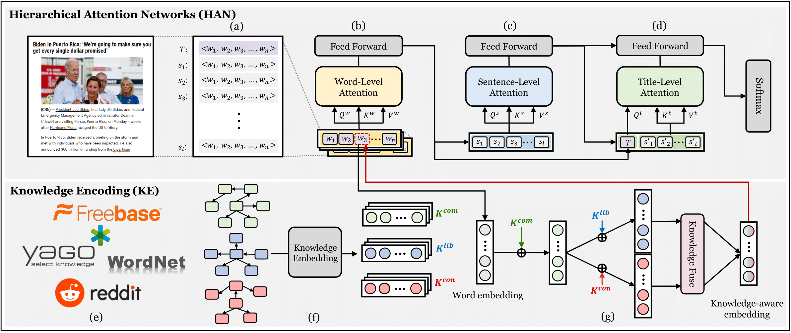

# KHAN: Knowledge-Aware Hierarchical Attention Networks for Accurate Political Stance Prediction

## The overview of KHAN


## Descriptions
1. News articles datasets (SemEval, AllSides-S, AllSides-L): [**link**](https://drive.google.com/drive/u/2/folders/1ksV0PUncXyBnEHGPB4H4mae2ybXX3Ch0)
2. Political Knowledge Graphs (KG-conservative, KG-liberal): [**link**](https://drive.google.com/drive/u/2/folders/1DHlKOhKgISw9VTYmbMvnsIbaaLRtqhbq)
3. Pre-trained KG embeddings (common, conservative, liberal): [**link**](https://drive.google.com/drive/u/2/folders/14EgeI1RdSTccETqRgDd36writP6lUu1R)

## File structure:
```
├── KHAN
      ├── datasets             # data for KHAN, you can download from above anonymous google drive link
            ├── article data
                  ├── SemEval
                  ├── Allsides-S
                  └── Allsides-L
                        ├── train
                        └── test
            ├── KG data
                  ├── KG-conservative
                        ├── entities_con.dict
                        ├── relations_con.dict
                        └── triplets_con.txt
                  └── KG-liberal
                        ├── entities_lib.dict
                        ├── relations_lib.dict
                        └── triplets_lib.txt
      └── pre-trained
            ├── common_emb
            ├── conservative_emb
            └── liberal_emb

```

## Dependencies
Our code runs on the Intel i7-9700k CPU with 64GB memory and NVIDIA RTX 2080 Ti GPU with 12GB, with the following packages installed:
```
python 3.8.10
torch 1.11.0
torchtext 0.12.0
pandas
numpy
argparse
sklearn
```

## How to train KHAN model
train the model by running:
```
python3 main.py \
  --gpu_index=0 \
  --batch_size=16 \
  --num_epochs=50 \
  --learning_rate=0.001 \
  --max_sentence=20 \
  --embed_size=256 \
  --dropout=0.3 \
  --num_layer=1 \
  --num_head=4 \
  --d_hid=128 \
  --dataset=SEMEVAL \
  --alpha=0.6 \
  --beta=0.2
```

